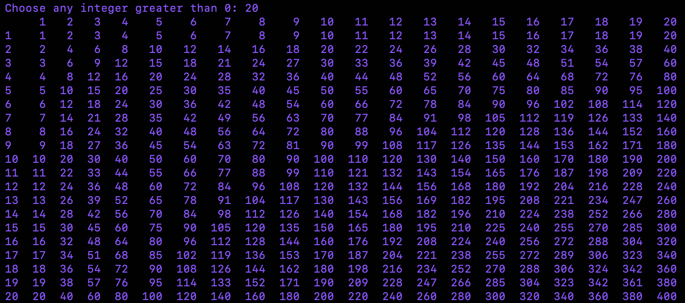

# What is this?

This repository is nothing more than a collection of mini-projects
and code I've made while learning Python.

I'm far from an expert at the language, but this is what I've managed
to do with it so far.

So, enjoy...

## file_ai.py

This file contains a small snippet of code that detects specific images
in my laptop's Downloads folder. Once it finds an image that matches
my parameters, it automatically moves the pic to a different folder.

This one didn't take long to make.

And I used Python's **os** and **shutil** libraries.

## times_table.py

This project is my first "tough" one in python. Using the **pandas**
library, I'm creating a script that does the following:

1. Allow user to input any integer n
2. Print the multiplication table for all integers 0 to n

For example, if you input n = 20, you'll have the following output...

